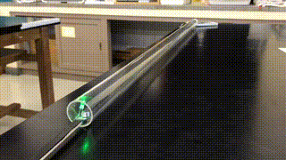
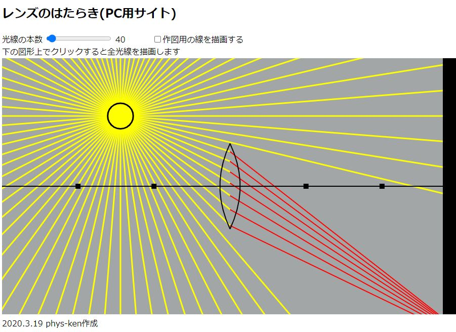

# Phys-Ken's Top Page

## 自己紹介
* 公立高校教員(理科・物理)
* Python、R、VBA、Google App Script
* Links
  * [Qiita](https://qiita.com/phys-ken)
  * [Youtube](https://www.youtube.com/channel/UCZ_2UC-s5Sv4bCqh2EKjNmw/videos)
  * [Twitter](https://twitter.com/phys_ken)
* 趣味でソフトウェア作成をしています。以下のリンクからアクセスできます。あくまで趣味で作成したものです。ミスがないようにしていますが、自己責任でご利用ください。
* TwitterのDMでご連絡いただければ、質問にはお答えします。しかし、趣味の域を出ない範囲でしか対応できないので、ご了承ください。校務が忙しいときには、まったくレスポンスがないかもしれません。

## 自作校務支援ソフト
* [採点斬り2021](https://github.com/phys-ken/saitenGiri2021)
  * デジタル採点支援のフリーソフト
  * ダウンロードの方法や使い方は、[解説動画](https://www.youtube.com/watch?v=zhaWaxFah2g)をご覧ください。

* [ウラオモテヤマネコ](https://phys-ken.github.io/uraomoteYamaneko/)
  * 両面スキャンした画像を、表裏ごとにフォルダ分けします

* [PDF2PPTX](https://github.com/phys-ken/pdf2pptx_win_mac)
  * PDFを一枚ずつ画像に変換し、パワーポイントに貼り付けます。推薦書の記入などで使えます。

* (silent_cutter)[https://github.com/phys-ken/silent_cutter] (python,ffmpegが必要です)
  * 動画の無音部分を切り取って、結合します。授業動画の作成を助けます。

* markdownを利用した教材作成の効率化<[発表資料](https://www2.hamajima.co.jp/~tenjin/ypc/217/20210725markdown.pdf)>
  * [docx_pptx2md](https://github.com/phys-ken/docx_pptx2md) (pythonが必要です)
    * すでに作成したワードやパワーポイントの資料を、markdownに変換します。
  * [md2exam](https://github.com/phys-ken/md2exam) (pythonとpandocが必要です)
    * マークダウンの階層構造を分析して、試験問題のテンプレートをワードで作成します。選択肢を自動でソートし、マークシート式の際に使える解答番号の自動振りも行えます。

## 教材作成

* [音量で明るさが変わるLED](https://phys-ken.github.io/volume_led2/README.html)
  * 

* [自作距離センサー](https://github.com/phys-ken/M5Stack_SonicDist)
  * 

* [電圧を高低で表すインタラクティブな図](https://phys-ken.github.io/Circuit_App/)
  * 

* [定常波の形成アニメーション](https://phys-ken.github.io/Resonance_Mov/Slide.html)
  * 

* [幾何光学シミュレーション](https://phys-ken.github.io/Optics/README.html)
  * 

