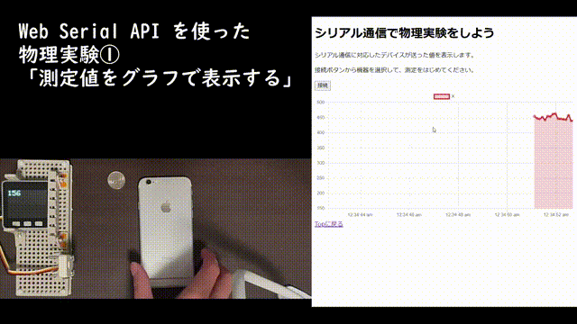
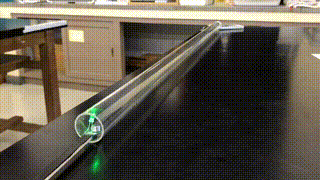
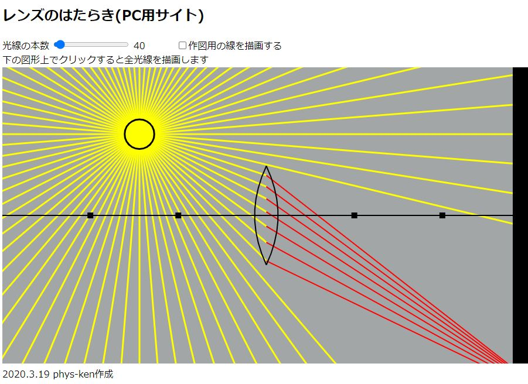

# 教材・ツール

物理の授業で使えるWebアプリケーションを作って公開しています。

!!! note "利用について"
    すべて趣味で作ったものです。授業で使っていただいても構いませんが、**自己責任**でお願いします。

## 実験・測定ツール

実際の測定やデータ取得に使えるツールです。

### Web Serial API 物理実験ツール

**ブラウザでリアルタイム測定**

[アプリを使う](https://phys-ken.github.io/webserial_app){ .md-button .md-button--primary }

Chromebookでセンサーからのデータをリアルタイムでグラフ化できます。生徒実験での測定・記録に便利です。

### 音量感応LEDシステム

**音に反応するLED制御**

[デモを見る](https://phys-ken.github.io/volume_led2/README.html){ .md-button }

マイクで拾った音量に応じてLEDの明るさが変わります。音波を目で見ることができます。

### 超音波距離センサー

**M5Stackを使った距離測定**

[詳細を見る](https://github.com/phys-ken/M5Stack_SonicDist){ .md-button }

M5Stackと超音波センサーで距離を測定し、データを記録できます。物体の運動の測定に使えます。

## シミュレーション

物理現象を視覚的に理解できるシミュレーションです。

### 電気回路の電位可視化

**回路の電位をアニメーションで表示**

[シミュレーション](https://phys-ken.github.io/Circuit_App/){ .md-button .md-button--primary }

回路内の電位の高低を色とアニメーションで表現します。抽象的な電位の概念を具体的に理解できます。

### 定常波の形成アニメーション

**波の重ね合わせを可視化**

[アニメーション](https://phys-ken.github.io/Resonance_Mov/Slide.html){ .md-button }

進行波と反射波が重なって定常波ができる様子をアニメーションで見ることができます。

### 幾何光学シミュレーション

**レンズの光線をシミュレーション**

[シミュレーション](https://phys-ken.github.io/Optics/README.html){ .md-button }

レンズを通る光線の屈折や集光の様子を可視化します。幾何光学の理解に役立ちます。

## 開発中のもの

### ばねのエネルギーシミュレーション

**弾性エネルギーと運動エネルギーの変換**

[プレビュー版](https://phys-ken.github.io/spring_energy_system/){ .md-button }

!!! info "開発状況"
    まだ作成中です。停止ボタンなどを追加予定です。

ばねの弾性エネルギーと物体の運動エネルギーが変換される様子を見ることができます。
