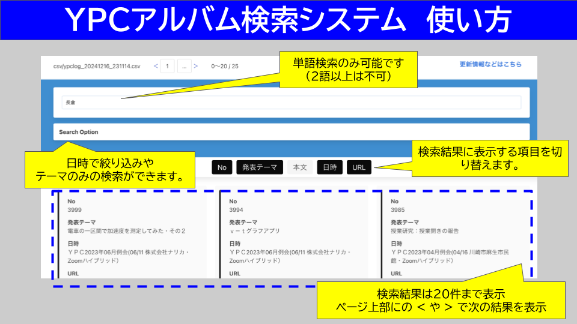

# YPC例会アルバム検索システム

!!! info "最新情報"
    **2024/12/11** 検索サイトの仕様を一新しました。ロードが早くなりました。

## 概要

横浜物理サークルのホームページの過去の例会資料を検索することができます。

### 検索機能の特徴

* **検索方式**: 単語の完全一致のみ（複数語検索は非対応）
* **データサイズ**: 初回読み込み時に約4MBのテキストデータを読み込みます
* **更新頻度**: 毎月手動更新（更新が遅れている場合はお知らせください）

[:material-magnify: 検索サイトへ移動](https://phys-ken.github.io/ypc_database/index2.html){ .md-button .md-button--primary }

## 使い方

## 既知の問題

### 記事の文章分割について

* **原因**: 元の例会アルバムのHTMLの`
`タグ構造を認識して分析しているため、タグ構造が標準と異なる場合に正しく分割されません
* **具体例**: 通し番号765「勝田さんの授業研究」では、元サイトの`
`タグが正しく閉じられていないため表示に問題があります
* **対応**: 現在のところ修正予定はありません

## 技術情報

検索サイトの詳細な仕様については、[GitHubリポジトリ](https://github.com/phys-ken/ypc_database)をご覧ください。
